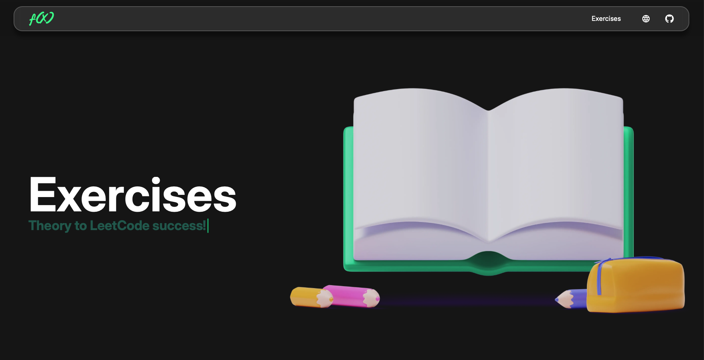
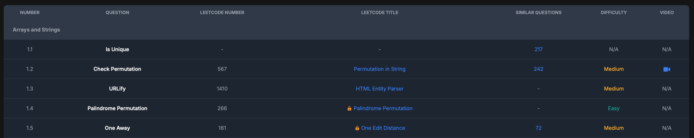

<!-- **WEBSITE** -->

 
 

  

<h1 align="center">
    <a href="https://github.com/Piero24/HashTo">HashTo</a>
</h1>

    <!-- BADGE -->
    <!--
        *** You can make other badges here
        *** [shields.io](https://shields.io/)
        *** or here
        *** [CircleCI](https://circleci.com/)
    -->
    
    
    <!-- -->
    
    

    A Website for mapping exercises from famous books or courses into leetcode problems.
     
    <a href="**WEBSITE**"><strong>Visit Website »</strong></a>
     
     
    <a href="https://github.com/Piero24/HashTo/issues">Report Bug</a>
    •
    <a href="https://github.com/Piero24/HashTo/issues">Request Feature</a>

---

  
<h2 id="introduction">📔  Introduction</h2>

    Questo progetto è stato creato per mappare gli esercizi di libri o corsi famosi in problemi di leetcode. Permettendo così a tutti di potersi esercitare facilmente senza ricorrere a carta e penna o a pochi test case. I libri sono ottimi per esercitarsi ma non sempre si ha la possibilità di controllare se la soluzione è corretta o meno. Questo progetto permette di avere un feedback immediato e di poter vedere se la soluzione è corretta o meno. I corsi banarlmente spesso forniscono pochi test cases e quindi è difficile sapere anche in questo caso se la nostra soluzione è corretta o meno.

 

    Questo progetto è nato con l'obbiettivo di mappare gli esercizi di libri famosi come cracking the coding interview o element of programming in problemi presenti su leetcode. In questo modo è possibile esercitarsi in modo più semplice e veloce. Aumentando notevomente la produttività e la possibilità di esercitarsi.

> [!NOTE]
> Questo progetto non contine alcun testo o video coperto da copyright e utilizzato inpropriamente. L'unica cosa fornita è il nome dell'essercizio e la rispettiva domanda su leetcode. This website helps users locate LeetCode problems that align with exercise titles from popular books and courses, providing a platform to test and refine their solutions to the problems discussed in those materials. No book content is hosted or shared here.
We fully respect the intellectual property of authors and publishers. This tool serves only as a reference guide to publicly available LeetCode problems and does not reproduce any proprietary material. We do not endorse or encourage any improper use of this list.
Instead, we strongly encourage users to purchase these books and courses to gain a deeper understanding of the concepts, benefit from detailed explanations, and acquire valuable insights into solving the problems effectively. Supporting the authors and creators ensures access to high-quality educational resources.

> [!WARNING]
> Non ci assumiamo nessuna responsabilità per un uso improrio di questo materiale e di tutto ciò che lo riguarda. Non ci assumiamo nessuna responsabilità per danni causati a persone e/o oggetti nell'uso del materiale.

 

    

 

<a href="#top">⇧</a>

<h2 id="documentation">  📚  Documentation</h2>

   

    Attualmente i libri corsi o liste di esercizzi inclusi sono:
    - Cracking the coding interview
    - Elements of programming (Python, Java, C++, etc...)
    - Leetcode 75

    Quelli aggiunti in futuro saranno:
    - Grokking the coding interview
    - Neetcode All
    - AlgoMap
    - Leetcode 150
    

> [!NOTE]
> Ricordiamo nuovamente che nessun materiale coperto da diritto d'autore è presente in questo progetto. L'unico scopo è quello di mappare gli esercizi in problemi di leetcode.

 

    

   

<a href="#top">⇧</a>

<h2 id="Contributions"> 🧰  Contributions</h2>

    Le contribuzioni per aiutare lo sviluppo del progetto sono ben accette.
    Se volete contribuire aggiungendo nuovi libri, corsi o esercizi siete i benvenuti.
    Seguite la sezione Contribution per vedere come fare.

 

<a href="#top">⇧</a>

---

<h3 id="responsible-disclosure"> 📮  Responsible Disclosure</h3>

    We assume no responsibility for an improper use of this code and everything related to it. We do not assume any responsibility for damage caused to people and / or objects in the use of the code.

<strong>
    By using this code even in a small part, the developers are declined from any responsibility.
</strong>
 
 

    It is possible to have more information by viewing the following links: <a href="https://github.com/Piero24/HashTo?tab=License-1-ov-file"><strong>License</strong></a>

<a href="#top">⇧</a>

<h3 id="report-a-bug"> 🐛  Bug and Feature</h3>

    To <strong>report a bug</strong> or to request the implementation of <strong>new features</strong>, it is strongly recommended to use the <a href="https://github.com/Piero24/HashTo/issues"><strong>ISSUES tool from Github »</strong></a>

 

    Here you may already find the answer to the problem you have encountered, in case it has already happened to other people. Otherwise you can report the bugs found.

 
<strong>
    ATTENTION: To speed up the resolution of problems, it is recommended to answer all the questions present in the request phase in an exhaustive manner.
</strong>
 
 

    (Even in the phase of requests for the implementation of new functions, we ask you to better specify the reasons for the request and what final result you want to obtain).

 

<a href="#top">⇧</a>

  
--- 

<h3 id="third-party-licenses"> 📌  Third Party Licenses</h3>

In the event that the software uses third-party components for its operation, 
 
the individual licenses are indicated in the following section.
 
 
<strong>Software list:</strong>
 
<table>
  <tr  align="center">
    <th>Software</th>
    <th>License owner</th> 
    <th>License type</th> 
    <th>Link</th>
  </tr>
  <tr  align="center">
    <td>OpenCV</td>
    <td><a href="https://opencv.org">OpenCV</a></td>
    <td>Apache-2.0 license</td>
    <td><a href="https://github.com/opencv/opencv">here</a></td>
  </tr>
  <tr  align="center">
    <td>nlohmann/json</td> 
    <td><a href="https://github.com/nlohmann">nlohmann</a></td>
    <td>MIT</td>
    <td><a href="https://github.com/nlohmann/json">here</a></td>
  </tr>
  <tr  align="center">
    <td>pyTorch</td>
    <td><a href="https://pytorch.org">PyTorch</a></td>
    <td>Multiple</td>
    <td><a href="https://github.com/pytorch/pytorch">here</a></td>
  </tr>
</table>

<a href="#top">⇧</a>

---
> *
 Copyrright (C) by Pietrobon Andrea   Released date: 05-01-2025*